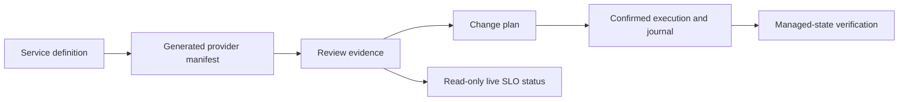

# Understand and change the SLO rules engine

Start here if you maintain this repository and need to find the code behind a
workflow. Read the current task in the
[housekeeping queue](housekeeping/project-structure-refactoring-plan.md#ordered-housekeeping-queue)
when choosing work; use the map below when making a change.

## What the engine does

A service definition says what reliability means for a service: the measurement
(SLI), the objective (SLO), the evaluation window, and the response policy.
The Ruby DSL represents this intent independently of an observability product.
A provider translates it into configuration for Datadog, Prometheus Stack, or
Sloth. Telemetry can suggest a definition, but a maintainer reviews the policy.

The engine also compares that configuration with existing state, plans changes,
and records confirmed execution. Prometheus Stack and Sloth manage local files;
another system deploys them or runs Sloth. Datadog uses an API. Live SLO status
reads telemetry to show whether the objective is being met.

## Follow one workflow



The important distinction is between intended configuration and observed
reliability. Verification asks whether managed files or resources match the
reviewed configuration. Live status asks whether measured reliability meets
the objective. A successfully applied configuration can still report an
exhausted error budget or missing telemetry.

These saved objects have different jobs:

| Object | Question it answers |
| --- | --- |
| Definition | What reliability does this service require? |
| Provider manifest | What configuration implements that intent for one provider? |
| Review report | Is that artifact valid and linked to current reviewed evidence? |
| Change plan | How does desired configuration differ from observed state? |
| Release bundle | Which definitions, artifacts, and evidence belong to this release? |
| Approved provider plan | Which exact operations were approved for one file-backed release target? |
| Operation journal and result | What was attempted, what succeeded, and what state was verified? |

Release bundles coordinate these objects across targets. The implemented
file-backed lifecycle is `review_ready` → `apply_ready` → `applied` → `verified`.
Each transition creates a successor with its own content-derived identity.
`plan apply` executes stored approved operations; `plan resume` retries only
eligible journaled writes. Those guarantees are stronger than replanning a
normal `apply` on every run.

For a concrete starting point, follow the
[local Prometheus Stack walkthrough](prometheus-stack-walkthrough.md). It
generates, reviews, plans, applies, checks drift, and prunes one public fixture.
Its [test](../test/prometheus_stack_walkthrough_test.rb) runs the complete
managed-file lifecycle without a backend.

## Find the code and its evidence

Paths below are relative to `lib/slo_rules_engine/` unless linked otherwise.
Start with the facade for the workflow you are changing, then follow its calls.

| Responsibility | Code to start with | Focused evidence |
| --- | --- | --- |
| Preserve artifact hashes and credential finding paths | [shared integrity](../lib/slo_rules_engine/artifact_integrity.rb); identity assembly stays with each workflow | [compatibility goldens](../test/artifact_integrity_compatibility_test.rb), [boundary checks](../test/architecture_fitness_test.rb) |
| Read intent and validate it | [DSL](../lib/slo_rules_engine/dsl/service_definition.rb), [model](../lib/slo_rules_engine/model.rb), [validation](../lib/slo_rules_engine/validation.rb) | [DSL](../test/dsl_test.rb), [validation](../test/validation_test.rb) |
| Translate intent into artifacts | [provider contract](../lib/slo_rules_engine/provider.rb), [Prometheus Stack provider](../lib/slo_rules_engine/providers/prometheus_stack.rb), [native renderer](../lib/slo_rules_engine/prometheus_stack/resource_renderer.rb) | [provider output](../test/prometheus_stack_provider_test.rb), [manifest schema](../test/manifest_schema_test.rb) |
| Review generated artifacts | [schema](../lib/slo_rules_engine/manifest_schema.rb), [review queue](../lib/slo_rules_engine/manifest_review_queue.rb), [review evidence](../lib/slo_rules_engine/manifest_review_evidence.rb) | [review queue](../test/manifest_review_queue_test.rb) |
| Package and plan a release | [bundle builder](../lib/slo_rules_engine/release_bundle/builder.rb), [planner](../lib/slo_rules_engine/release_bundle/planner.rb) | [bundle model](../test/release_bundle_test.rb), [bundle CLI](../test/release_bundle_cli_test.rb) |
| Compare or change file state | [file applier](../lib/slo_rules_engine/appliers/manifest_bundle.rb), [shared state contracts](../lib/slo_rules_engine/provider_state.rb) | [apply](../test/apply_test.rb), [walkthrough](../test/prometheus_stack_walkthrough_test.rb) |
| Approve, journal, replay, and resume | [approved plan](../lib/slo_rules_engine/provider_state/approved_plan.rb), [exact executor](../lib/slo_rules_engine/provider_state/exact_plan_executor.rb), [journal execution](../lib/slo_rules_engine/provider_state/journal_execution.rb) | [approved plan](../test/provider_state_approved_plan_test.rb), [transitions](../test/provider_state_journal_transition_test.rb), [exact-plan CLI](../test/provider_state_exact_plan_cli_test.rb) |
| Apply and verify a complete release | [bundle applier](../lib/slo_rules_engine/release_bundle/applier.rb), [verifier](../lib/slo_rules_engine/release_bundle/verifier.rb), [managed-file verifier](../lib/slo_rules_engine/provider_state/managed_file_verifier.rb) | [release apply](../test/release_bundle_apply_test.rb), [release verify](../test/release_bundle_verify_test.rb) |
| Read current SLO status | [Prometheus status](../lib/slo_rules_engine/live_status.rb), [Sloth reader](../lib/slo_rules_engine/live_status/sloth_reader.rb), [aggregate](../lib/slo_rules_engine/live_status/aggregate.rb) | [status](../test/live_status_test.rb), [Sloth status](../test/sloth_live_status_test.rb), [aggregate](../test/live_status_aggregate_test.rb) |
| Turn telemetry into reviewed intent | [candidate generator](../lib/slo_rules_engine/onboarding/candidate_generator.rb), [handoff reviewer](../lib/slo_rules_engine/onboarding/handoff_reviewer.rb) | [onboarding](../test/onboarding_test.rb), [handoff](../test/onboarding_handoff_test.rb) |

For Datadog changes, start with `providers/datadog.rb` for generation and
`datadog/` plus `appliers/datadog.rb` for backend reconciliation. For Sloth
generated-rule identity, start with `sloth/downstream_evidence.rb`. The
[architecture reference](design.md) covers the remaining boundaries and
dependencies; it is useful after locating the workflow.

### Trace a generated file back to its definition

For `generated/prometheus-rules.yaml`, start with the
[file applier](../lib/slo_rules_engine/appliers/manifest_bundle.rb):
`managed_bundle_resource_entries` selects the manifest's native resource and
`write_operation` serializes it as YAML during confirmed apply. Trace that
resource's origin through
[ResourceRenderer](../lib/slo_rules_engine/prometheus_stack/resource_renderer.rb)
← [PrometheusStack](../lib/slo_rules_engine/providers/prometheus_stack.rb)
← [GenerateProviderManifests](../lib/slo_rules_engine/application/generation_commands.rb)
← [DefinitionLoader](../lib/slo_rules_engine/application/input_loaders.rb).
The walkthrough loads
[reviewed-checkout.rb](../examples/prometheus-stack/reviewed-checkout.rb), which
adds review provenance to [checkout.rb](../examples/services/checkout.rb).
The writer in `application/generation_commands.rb` saves manifest JSON and its
review report below the selected service/provider output root. Generation embeds
native resource content in the manifest; file-backed apply materializes the YAML.

### Follow a Human and Agent command to the same handler

Run these from the repository root; both generate the same provider manifest
and save artifacts below `work/generated`:

```bash
bin/rules-ctl generate --provider=prometheus_stack \
  --output-dir=./work/generated examples/prometheus-stack/reviewed-checkout.rb

bin/rules-ctl agent invoke generate \
  --json='{"schema_version":"slo-rules-engine/agent-command-request/v1","command_id":"generate","command_version":1,"arguments":{"provider":"prometheus_stack","definition_files":["examples/prometheus-stack/reviewed-checkout.rb"],"output_dir":"./work/generated"}}'
```

[bin/rules-ctl](../bin/rules-ctl) loads the CLI. The Human path resolves the
command through [CommandRegistry](../lib/slo_rules_engine/cli/command_registry.rb),
then `RulesCtl.generate` in [cli.rb](../lib/slo_rules_engine/cli.rb) parses flags.
The Agent path enters [AgentInvocation](../lib/slo_rules_engine/cli/agent_invocation.rb),
validates the registered request, and resolves the application class declared in
[the generation contract](../lib/slo_rules_engine/cli/command_contracts/generation.rb).
Both call `Application::GenerateProviderManifests`. The adapters format the
result; the Agent adapter adds its envelope and workspace policy.

When maintaining `generate`, the declaration above owns usage, the JSON example,
and the request schema. Check [Agent input policy](../lib/slo_rules_engine/application/input_safety.rb)
alongside the adapter and shared handler. The
[Agent write tests](../test/agent_write_commands_test.rb) cover Human/Agent
equivalence, confined outputs, and zero-I/O validation; the
[contract preservation tests](../test/command_contract_preservation_test.rb)
lock registry, catalog, and describe output. Inspect `agent describe generate`
and update its task usage in [use cases](use-cases.md) when behavior changes.

This shared seam is implemented for the executable Agent commands. Other
commands still have Human handlers that directly coordinate domain objects:
`apply`, `import`, and `prune` remain in `cli.rb`; bundle, plan, journal, and
status commands have modules under `cli/`. Their structured invocation remains
gated. A registered JSON example describes a contract, not execution support.
Check `structured_invocation` with `agent describe COMMAND_ID` before using it.

### Find why apply was refused

For normal confirmed apply, start with `RulesCtl.apply` and the
`validate_apply_review_evidence!` / `validate_live_manifest_review!` helpers in
`cli.rb`. They require a reviewed manifest and check the supplied review
evidence. File-backed execution also requires a journal directory.
For `plan apply`, start with `provider_state/exact_plan_executor.rb`; for
`bundle apply`, start with `release_bundle/applier.rb`. They add exact approval,
freshness, scope-lock, lineage, and execution checks. Follow the reported finding
to the focused test instead of weakening the gate to make a command run.

## Make one understandable change

Locate the owning workflow and read its focused test before editing. Keep one
reason for the change. For example, changing Prometheus output starts with the
provider and renderer; moving journal storage starts with journal classes and
transition tests. Preserve saved field shapes, identities, findings, and
operation ordering during a structural move.

A change to a CLI command also involves its Human handler, Agent mapping,
contract declaration, introspection, equivalence evidence, and task usage.
Each command is authored in its owning `cli/command_contracts/` family.
`cli/command_registry.rb` composes those declarations and projects the compact
catalog. The [HK-05 evidence](housekeeping/project-structure-refactoring-plan.md#hk-05-finish-command-declarations-without-enabling-commands)
records the preservation checks. Avoid adding a second policy implementation
in an adapter.

Run the owning tests, then the repository gates:

```bash
scripts/structure-report --check
git diff --check
./scripts/verify.sh
```

Use [Engineering Use Cases](use-cases.md) for operational steps and exact
outputs. Use the [Agent roadmap](agent-interface-roadmap.md#feature-packets) for
remaining automation features and the
[implementation history](implementation-plan.md) for delivered scope.
The [abstraction audit](housekeeping/abstraction-layer-review.md) explains which
existing layers to keep and where duplication or ownership is inconsistent.
The housekeeping queue owns current execution order. Revisit feature expansion
with the maintainer after its first tranche.
